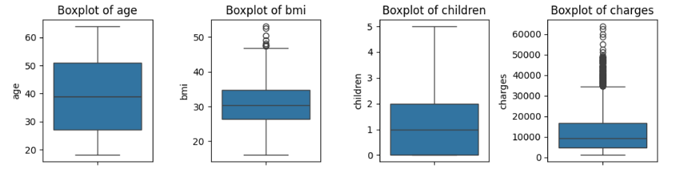
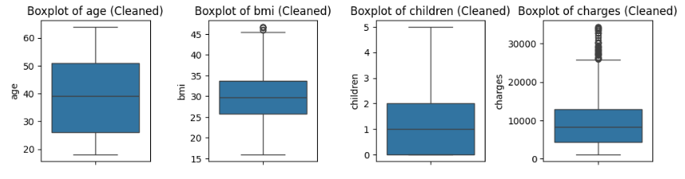
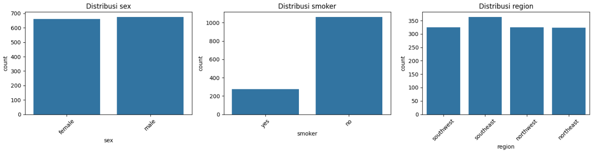
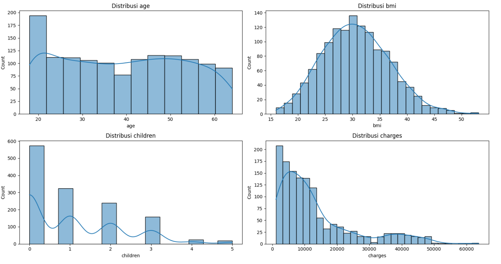
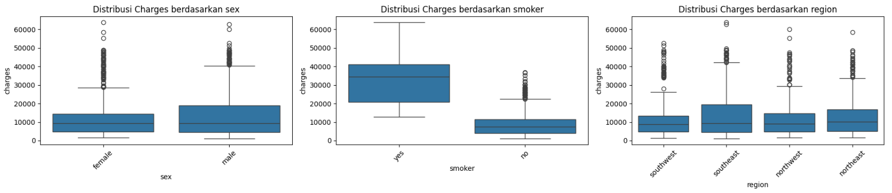
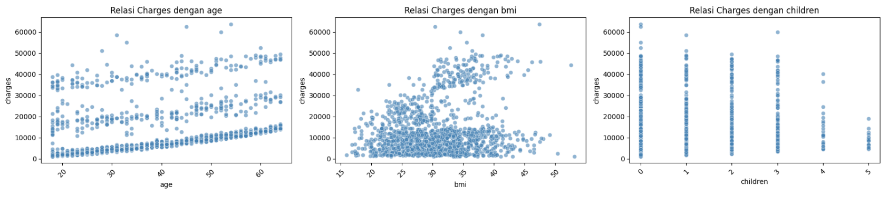
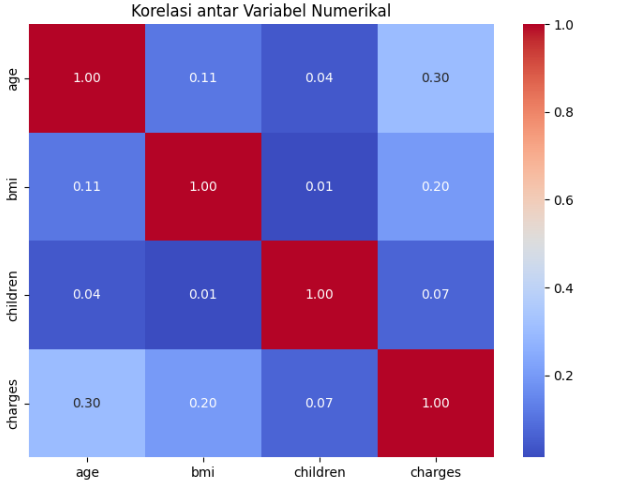

# Laporan Proyek Machine Learning - Imelda Cyntia

## Domain Proyek : Kesehatan

### Latar Belakang

Biaya asuransi kesehatan terus meningkat dari tahun ke tahun, mendorong perusahaan asuransi dan individu untuk mencari pendekatan prediktif yang lebih akurat dalam perencanaan keuangan dan penetapan premi. Berbagai faktor seperti usia, jenis kelamin, indeks massa tubuh (BMI), status merokok, jumlah anak, dan wilayah tempat tinggal diketahui turut memengaruhi besar kecilnya biaya asuransi. Penerapan algoritma machine learning memungkinkan analisis yang lebih presisi terhadap variabel-variabel ini untuk menghasilkan prediksi biaya yang lebih objektif dan berbasis data.

Studi oleh Alhassan dan Batrushi (2022) menunjukkan bahwa penerapan model machine learning secara signifikan dapat meningkatkan akurasi prediksi premi asuransi dibandingkan pendekatan tradisional. Model prediktif ini membantu perusahaan asuransi menentukan premi secara adil dan membantu individu mengelola pengeluaran kesehatannya secara lebih terencana. Selain itu, menurut World Health Organization (2023), pengeluaran kesehatan global meningkat rata-rata 3,9% per tahun sejak tahun 2000, dengan asuransi kesehatan menjadi salah satu komponen pembiayaan utama. Oleh karena itu, membangun model prediksi biaya asuransi berbasis data menjadi langkah penting dalam meningkatkan efisiensi sistem kesehatan secara keseluruhan.

### Referensi

* Alhassan, I., & Batrushi, B. (2022). Health Insurance Premium Prediction Using Machine Learning Techniques. International Journal of Environmental Research and Public Health, 19(13), 7898. [https://doi.org/10.3390/ijerph19137898](https://doi.org/10.3390/ijerph19137898)
* World Health Organization. (2023). Global spending on health: Rising to the pandemic’s challenges. [https://www.who.int/publications/i/item/9789240076643](https://www.who.int/publications/i/item/9789240076643)

## Business Understanding

### Problem Statements

- Bagaimana cara memprediksi biaya asuransi kesehatan berdasarkan fitur-fitur seperti usia, jenis kelamin, kebiasaan merokok, BMI, dan wilayah tempat tinggal?
- Apakah faktor-faktor seperti kebiasaan merokok atau BMI memberikan pengaruh signifikan terhadap besarnya biaya asuransi?

### Goals

- Membangun model prediksi regresi untuk memperkirakan biaya asuransi kesehatan berdasarkan karakteristik pengguna.
- Mengidentifikasi fitur atau atribut yang paling berpengaruh terhadap besarnya biaya asuransi.

### Solution statements

Untuk mencapai tujuan tersebut, pendekatan berikut akan dilakukan:

- Menerapkan beberapa algoritma regresi lainnya seperti K-Nearest Neighbor, Random Forest Regressor dan Gradient Boosting Regressor untuk melihat performa yang lebih baik.

- Menggunakan metrik evaluasi seperti Mean Squared Error (MSE) untuk mengukur akurasi dan efektivitas model.

## Data Understanding

Proyek ini menggunakan dataset Insurance yang tersedia secara publik melalui platform Kaggle: [https://www.kaggle.com/datasets/mirichoi0218/insurance](https://www.kaggle.com/datasets/mirichoi0218/insurance). Dataset ini berisi data demografis dan gaya hidup individu serta jumlah biaya asuransi kesehatan yang dibebankan kepada mereka. Karena targetnya berbentuk nilai numerik (charges), dataset ini cocok digunakan untuk membangun model prediksi regresi.

Dataset terdiri dari 1.338 baris dan 7 kolom, dengan setiap baris mewakili satu individu. Dari eksplorasi awal, tidak ditemukan nilai hilang (missing value), sehingga data dalam kondisi bersih. Selanjutnya, fitur-fitur dibagi berdasarkan tipe datanya:

* Fitur kategorikal: sex, smoker, region
* Fitur numerikal: age, bmi, children, charges

Pengecekan dan penanganan outlier dilakukan khususnya pada fitur numerikal menggunakan metode IQR (Interquartile Range). Data yang mengandung outlier telah dibersihkan agar tidak memengaruhi kualitas prediksi.

### Variabel-variabel pada Insurance Dataset adalah sebagai berikut:

* age: Usia pemegang polis (dalam tahun).
* sex: Jenis kelamin pemegang polis (male atau female).
* bmi: Body Mass Index (indeks massa tubuh).
* children: Jumlah anak yang menjadi tanggungan.
* smoker: Status merokok individu (yes atau no).
* region: Wilayah tempat tinggal di AS (southwest, southeast, northwest, northeast).
* charges: Biaya yang dibebankan oleh asuransi (dalam USD) – ini adalah target prediksi.

### Rubrik/Kriteria Tambahan (Opsional):

Beberapa tahapan eksplorasi data telah dilakukan untuk memahami karakteristik dataset, antara lain:

  #### 1. Pembersihan data dilakukan dengan menghapus outlier berdasarkan boxplot dan metode IQR.

  
Dari gambar di atas menunjukkan bahwa beberapa fitur numerik yang dianalisis mengandung nilai pencilan (outliers).



Dari gambar di atas disimpulkan bahwa dataset telah terbersihkan dan jumlah sampel yang tersedia sekarang adalah 1191.

  #### 2. Visualisasi univariat menggunakan countplot dan histogram untuk melihat distribusi masing-masing fitur.

  
Fitur kategorikal menunjukkan beberapa pola penting. Distribusi sex antara laki-laki dan perempuan relatif seimbang, sehingga model tidak menunjukkan potensi bias terhadap jenis kelamin tertentu. Pada fitur smoker, mayoritas responden merupakan non-smoker, namun proporsi perokok tetap signifikan dan menjadi variabel penting karena memiliki pengaruh besar terhadap biaya asuransi. Sementara itu, distribusi region cukup merata di antara keempat wilayah, dengan sedikit dominasi pada wilayah southeast, yang tetap memberikan representasi geografis yang adil dalam dataset.



Fitur numerikal juga memberikan insight yang berharga. Distribusi usia (age) cukup merata dengan konsentrasi pada usia dewasa muda hingga pertengahan. BMI terdistribusi hampir normal dengan sedikit skew ke kanan, dan setelah penghapusan outlier, distribusinya terlihat lebih bersih meskipun masih terdapat beberapa individu dengan nilai BMI tinggi. Fitur children menunjukkan bahwa sebagian besar individu memiliki 0 hingga 2 anak, tanpa adanya nilai ekstrem. Terakhir, fitur charges menunjukkan distribusi yang sangat skew ke kanan, menandakan bahwa hanya sebagian kecil individu yang memiliki biaya asuransi sangat tinggi, yang kemungkinan besar berkaitan dengan status merokok atau kondisi kesehatan tertentu.

  #### 3. Visualisasi bivariat seperti boxplot dan scatterplot digunakan untuk melihat hubungan antara fitur dan target (charges).

  
Pada variabel sex, rata-rata biaya asuransi pria sedikit lebih tinggi dibanding wanita, namun perbedaannya tidak signifikan dan distribusinya cukup mirip. Variabel smoker menunjukkan pengaruh paling signifikan, di mana perokok memiliki biaya asuransi yang jauh lebih tinggi dibanding non-perokok, dan hampir semua outlier biaya tinggi berasal dari kelompok perokok. Sementara itu, variabel region menunjukkan bahwa distribusi charges relatif serupa di setiap wilayah, tanpa perbedaan signifikan antar region.



Terdapat korelasi positif antara usia dan charges yaitu semakin tua usia individu, semakin tinggi biaya asuransi yang dikenakan, kemungkinan karena peningkatan risiko kesehatan. Sementara itu, BMI tidak menunjukkan hubungan linier yang kuat dengan charges, namun terdapat beberapa outlier pada BMI tinggi yang menunjukkan potensi biaya lebih besar akibat kondisi seperti obesitas. Untuk variabel children, tidak ditemukan pengaruh signifikan terhadap charges, karena distribusi biaya relatif stabil terlepas dari jumlah anak.

  #### 4. Heatmap korelasi antar fitur numerik dilakukan untuk mengidentifikasi kekuatan dan arah hubungan antar variabel.

  
Berdasarkan output heatmap korelasi, terdapat korelasi positif yang cukup kuat antara usia dan charges (0.45), menunjukkan bahwa biaya asuransi cenderung meningkat seiring bertambahnya usia. Sementara itu, BMI (-0.06) dan jumlah anak (0.09) memiliki korelasi sangat lemah terhadap charges, yang menandakan pengaruh keduanya relatif kecil. Selain itu, korelasi antar variabel independen juga rendah, sehingga tidak ditemukan indikasi multikolinearitas yang signifikan dalam data.

## Data Preparation

Tahapan data preparation sangat penting untuk memastikan bahwa data yang digunakan dalam proses pemodelan bersih, relevan, dan berada dalam format yang dapat diproses oleh algoritma machine learning. Pada proyek ini, langkah-langkah data preparation dilakukan secara sistematis dan berurutan sebagai berikut:

### 1. Encoding Fitur Kategorikal

Untuk mengubah fitur kategorikal menjadi numerik:

* sex diubah menjadi 0 untuk female dan 1 untuk male (binary encoding).
* smoker diubah menjadi 0 untuk no dan 1 untuk yes (binary encoding).
* region diubah menggunakan one-hot encoding karena memiliki lebih dari dua kategori (southwest, southeast, northwest, northeast).

📌 Alasan: Model machine learning tidak dapat memproses data bertipe kategorikal secara langsung, sehingga fitur kategorikal perlu diubah menjadi bentuk numerik.

### 2. Pembagian Dataset

Dataset dibagi menjadi data latih dan data uji menggunakan train\_test\_split dari sklearn, dengan rasio 80% data latih dan 20% data uji.

📌 Alasan: Pemisahan ini bertujuan untuk mengevaluasi performa model pada data yang belum pernah dilihat sebelumnya, sehingga dapat menilai kemampuan generalisasi model.

### 3. Standardisasi Fitur Numerik

Fitur numerik age, bmi, dan children distandarisasi menggunakan StandardScaler dari sklearn.

📌 Alasan: Standardisasi diperlukan agar setiap fitur berada dalam skala yang sama. Ini sangat penting untuk model seperti KNN dan Gradient Boosting yang sensitif terhadap perbedaan skala antar fitur.

## Modeling

**Tahap Modeling**

- Menyiapkan DataFrame untuk Analisis Masing-Masing Model
    ```python
    models = pd.DataFrame(index=['train_mse', 'test_mse'],
                      columns=['KNN', 'RandomForest', 'GradientBoosting'])
    ```
   Langkah pertama adalah membuat sebuah DataFrame bernama models yang akan digunakan untuk mencatat nilai Mean Squared Error (MSE) baik untuk data pelatihan maupun data pengujian dari tiga model regresi: KNN, Random Forest, dan Gradient Boosting.
- Melatih model KNN
    ```python
    knn = KNeighborsRegressor(n_neighbors=5)
    knn.fit(X_train, y_train)
    ```
  Model K-Nearest Neighbors diterapkan dengan nilai tetangga terdekat (n_neighbors) sebanyak 5. Model ini dilatih menggunakan data pelatihan X_train dan y_train, kemudian nilai MSE-nya dicatat pada DataFrame models.
- Melatih model Random Forest
    ```python
    rf = RandomForestRegressor(n_estimators=100, max_depth=10, random_state=42)
    rf.fit(X_train, y_train)
    ```
    Model RandomForestRegressor digunakan dengan parameter jumlah pohon sebanyak 100 (n_estimators=100), kedalaman maksimum pohon 10 (max_depth=10), dan seed acak (random_state=42) untuk hasil yang reprodusibel. Model ini juga dilatih dengan data pelatihan yang sama dan hasil evaluasinya dicatat.
- Melatih model Ada Gradient Boosting
    ```python
    gb = GradientBoostingRegressor(n_estimators=100, learning_rate=0.1, max_depth=3, random_state=42)
    gb.fit(X_train, y_train)
    ```
    Model Gradient Boosting diterapkan dengan jumlah estimasi sebanyak 100, laju pembelajaran (learning_rate) sebesar 0.1, dan kedalaman maksimum 3. Sama seperti model sebelumnya, model ini dilatih menggunakan data pelatihan dan hasil MSE-nya disimpan dalam DataFrame models.

**Tahapan dan Parameter yang Digunakan**

| **Model**               | **Tahapan**                                                                                                                                     | **Parameter yang Digunakan**                                                          | **Train MSE**                                 |
| ----------------------- | ----------------------------------------------------------------------------------------------------------------------------------------------- | ------------------------------------------------------------------------------------- | --------------------------------------------- |
| **K-Nearest Neighbors** | - Inisialisasi model dengan `KNeighborsRegressor`  <br> - Latih dengan `X_train`, `y_train` <br> - Hitung dan simpan MSE pada `models`          | `n_neighbors=5`                                                                       | `models.loc['train_mse', 'KNN']`              |
| **Random Forest**       | - Inisialisasi model dengan `RandomForestRegressor` <br> - Latih dengan data pelatihan <br> - Simpan hasil MSE ke dalam `models`                | `n_estimators=100` <br> `max_depth=10` <br> `random_state=42`                         | `models.loc['train_mse', 'RandomForest']`     |
| **Gradient Boosting**   | - Inisialisasi model dengan `GradientBoostingRegressor` <br> - Latih dengan `X_train`, `y_train` <br> - Hitung dan simpan MSE ke dalam `models` | `n_estimators=100` <br> `learning_rate=0.1` <br> `max_depth=3` <br> `random_state=42` | `models.loc['train_mse', 'GradientBoosting']` |

**Kelebihan dan Kekurangan Setiap Algoritma**

Berikut adalah tabel Kelebihan dan Kekurangan dari ketiga algoritma regresi:

| **Model**               | **Kelebihan**                                                                                                                                       | **Kekurangan**                                                                                                                                         |
| ----------------------- | --------------------------------------------------------------------------------------------------------------------------------------------------- | ------------------------------------------------------------------------------------------------------------------------------------------------------ |
| **K-Nearest Neighbors** | - Sederhana dan mudah diimplementasikan <br> - Tidak memerlukan asumsi distribusi data <br> - Cocok untuk data non-linear                           | - Sensitif terhadap skala dan outlier <br> - Kinerja menurun pada dataset besar karena komputasi prediksi lambat <br> - Tidak memiliki model eksplisit |
| **Random Forest**       | - Dapat menangani data numerik dan kategorikal <br> - Mengurangi overfitting melalui agregasi banyak pohon <br> - Robust terhadap outlier dan noise | - Lebih lambat dibanding model sederhana <br> - Interpretabilitas terbatas <br> - Ukuran model bisa besar                                              |
| **Gradient Boosting**   | - Performa prediktif sangat baik <br> - Menangani hubungan kompleks dan non-linear <br> - Dapat dikustomisasi dengan banyak parameter               | - Rentan terhadap overfitting jika tidak dituning <br> - Proses pelatihan lebih lambat <br> - Lebih kompleks dalam tuning parameter                    |

##################################BATAS SAYA KERJAKAN===================
## Evaluation

Pada bagian ini anda perlu menyebutkan metrik evaluasi yang digunakan. Lalu anda perlu menjelaskan hasil proyek berdasarkan metrik evaluasi yang digunakan.

Sebagai contoh, Anda memiih kasus klasifikasi dan menggunakan metrik **akurasi, precision, recall, dan F1 score**. Jelaskan mengenai beberapa hal berikut:

- Penjelasan mengenai metrik yang digunakan
- Menjelaskan hasil proyek berdasarkan metrik evaluasi

Ingatlah, metrik evaluasi yang digunakan harus sesuai dengan konteks data, problem statement, dan solusi yang diinginkan.


**Memilih Model Terbaik Sebagai Solusi**

Berdasarkan evaluasi menggunakan nilai MSE pada data uji, model terbaik dipilih sebagai solusi. Misalnya, jika model Random Forest menunjukkan MSE terendah pada data uji dibandingkan dengan KNN dan AdaBoost, maka model Random Forest dipilih sebagai model terbaik.


**Rubrik/Kriteria Tambahan (Opsional)**:

- Menjelaskan formula metrik dan bagaimana metrik tersebut bekerja.

**---Ini adalah bagian akhir laporan---**

_Catatan:_

- _Anda dapat menambahkan gambar, kode, atau tabel ke dalam laporan jika diperlukan. Temukan caranya pada contoh dokumen markdown di situs editor [Dillinger](https://dillinger.io/), [Github Guides: Mastering markdown](https://guides.github.com/features/mastering-markdown/), atau sumber lain di internet. Semangat!_
- Jika terdapat penjelasan yang harus menyertakan code snippet, tuliskan dengan sewajarnya. Tidak perlu menuliskan keseluruhan kode project, cukup bagian yang ingin dijelaskan saja.
